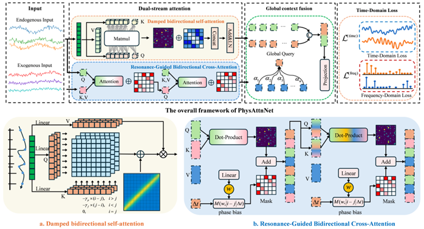
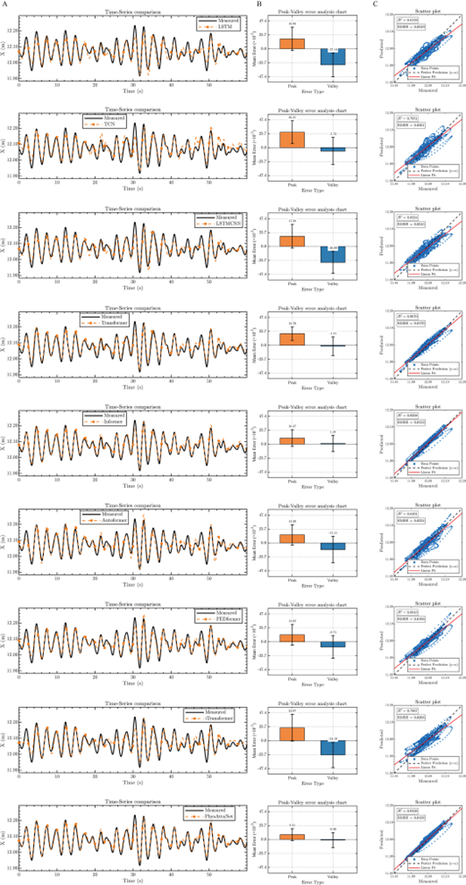
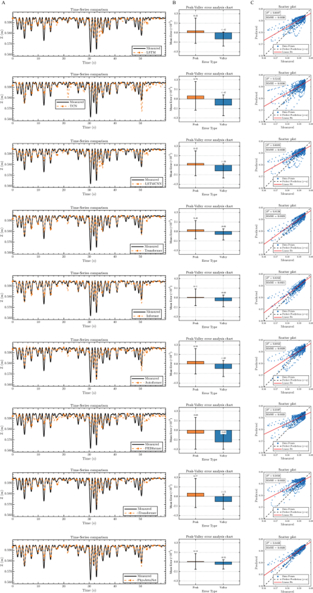
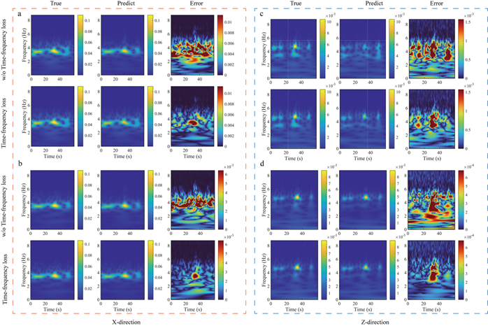

## Introduction

This research aims to develop a novel deep learning framework to achieving high-precision prediction of motion response prediction for elastic Bragg breakwaters.

## PhysAttnNet



## Run

```bash
bash ./scripts/wave_forecast/Test.sh
```

## Result




